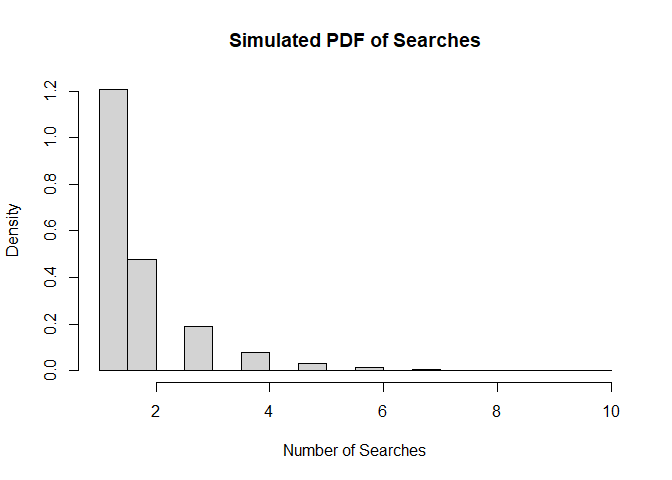
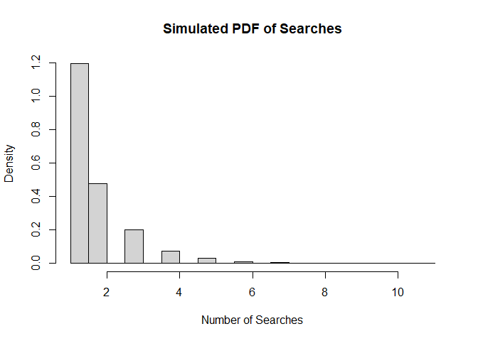

SA1 MONFER0 & PATAYON
================

1.  
2.  With your own computing experience, develop a front end to R that
    allows the user:

<!-- -->

1)  to input the values of a univariate discrete random variable and the
    associated probabilities and to obtain the mean and variance, and
2)  to input the values of a bivariate discrete random variable and the
    associated probabilities and to obtain the marginal and conditional
    distributions.

Your program should provide a facility to calculate the mean and
variance of each distribution, and to plot the pdf and cdf. In each
program, do validity checks that the probabilities are in the interval
\[0, 1\], and that they sum to one.

``` r
library(shiny)
```

    ## Warning: package 'shiny' was built under R version 4.3.3

``` r
library(ggplot2)

ui <- fluidPage(
  
  # title of the project
  titlePanel("Discrete Random Variable Analyzer"),
  
  # sidebar layout with input and output
  sidebarLayout(
    sidebarPanel(
      
      # univariate user input
      h4("Univariate Discrete Random Variable"),
      textInput("values_univariate", "Values (comma-separated):", value = ""),
      textInput("probabilities_univariate", "Probabilities (comma-separated):", value = ""),
      p("Input value on the interval of 0 to 1"),
    
      
      # bivariate user input
      h4("Bivariate Discrete Random Variable"),
      textInput("values_bivariate", "Values (comma-separated):", value = ""),
      textInput("probabilities_bivariate", "Probabilities (comma-separated):", value = ""),
      p("Input value on the interval of 0 to 1"),
      
      # calculate button
      actionButton("calculate_btn", "Calculate")
    ),
    
    mainPanel(
      # display mean and variance
      h4("Mean and Variance of univariate discrete random variable "),
      verbatimTextOutput("mean_var_output"),
      
      # display bivariate distributions
      h4("Marginal and conditional distributions of bivariate discrete random variable"),
      verbatimTextOutput("bivariate_output"),
      
      # plots for PDF and CDF
      h4("Plots"),
      plotOutput("pdf_plot"),
      plotOutput("cdf_plot")
    )
  )
)

server <- function(input, output) {
  
  # formula mean and variance for univariate random var
  univariate_stats <- eventReactive(input$calculate_btn, {
    values <- as.numeric(unlist(strsplit(input$values_univariate, ",")))
    probs <- as.numeric(unlist(strsplit(input$probabilities_univariate, ",")))
    
    if (any(is.na(values)) || any(is.na(probs))) {
      return("Please enter values and probabilities.")
    }
    
    if (length(values) != length(probs)) {
      return("Length of values and probabilities must be the same.")
    }
    
    if (sum(probs) != 1 || any(probs < 0) || any(probs > 1)) {
      return("Invalid probabilities! Probabilities must sum to 1 and be in the interval [0, 1].")
    }
    
    mean_value <- sum(values * probs)
    variance <- sum((values - mean_value)^2 * probs)
    
    c(mean = mean_value, variance = variance)
  })
  
  # formula for marginal and conditional distributions of bivariate random var
  bivariate_stats <- eventReactive(input$calculate_btn, {
    values <- as.numeric(unlist(strsplit(input$values_bivariate, ",")))
    probs <- as.numeric(unlist(strsplit(input$probabilities_bivariate, ",")))
    
    if (any(is.na(values)) || any(is.na(probs))) {
      return("Please enter values and probabilities.")
    }
    
    if (length(values) != length(probs)) {
      return("Length of values and probabilities must be the same.")
    }
    
    if (sum(probs) != 1 || any(probs < 0) || any(probs > 1)) {
      return("Invalid probabilities! Probabilities must sum to 1 and be in the interval [0, 1].")
    }
    
    marginal_probs <- probs / sum(probs)
    conditional_probs <- outer(marginal_probs, marginal_probs, FUN = "*")
    
    list(marginal = marginal_probs, conditional = conditional_probs)
  })
  
  # display mean and variance for univariate distribution
  output$mean_var_output <- renderPrint({
    univariate_stats()
  })
  
  # display marginal and conditional distributions ofbivariate distributions
  output$bivariate_output <- renderPrint({
    bivariate_stats()
  })
  
  # plot PDF for univariate distribution
  output$pdf_plot <- renderPlot({
    values <- as.numeric(unlist(strsplit(input$values_univariate, ",")))
    probs <- as.numeric(unlist(strsplit(input$probabilities_univariate, ",")))
    
    if (any(is.na(values)) || any(is.na(probs))) {
      return(NULL)
    }
    
    df <- data.frame(value = values, probability = probs)
    
    ggplot(df, aes(x = value, y = probability)) +
      geom_bar(stat = "identity", fill = "blue") +
      labs(title = "Probability Density Function (PDF)",
           x = "Value", y = "Probability") +
      theme_minimal()
  })
  
  # plot CDF for univariate distribution
  output$cdf_plot <- renderPlot({
    values <- as.numeric(unlist(strsplit(input$values_univariate, ",")))
    probs <- as.numeric(unlist(strsplit(input$probabilities_univariate, ",")))
    
    if (any(is.na(values)) || any(is.na(probs))) {
      return(NULL)
    }
    
    df <- data.frame(value = values,
                     cumulative_probability = cumsum(probs))
    
    ggplot(df, aes(x = value, y = cumulative_probability)) +
      geom_step(direction = "hv", color = "blue") +
      labs(title = "Cumulative Distribution Function (CDF)",
           x = "Value", y = "Cumulative Probability") +
      theme_minimal()
  })
}

# Run the application
shinyApp(ui = ui, server = server)
```

<div style="width: 100% ; height: 400px ; text-align: center; box-sizing: border-box; -moz-box-sizing: border-box; -webkit-box-sizing: border-box;" class="muted well">Shiny applications not supported in static R Markdown documents</div>

3.  By generating 10,000 searches in R, carry out a simulation
    experiment for a search engine going through a list of sites for a
    given key phrase, until the key phrase is found. You should allow
    your program to input the probability p that any site will contain
    the key phrase

4.  Plot the simulated pdf and calculate its mean and variance, and

5.  Obtain the simulated conditional distribution of searches when three
    searches have been carried out without success. Calculate its mean
    and variance, and satisfy yourself that they are equivalent to the
    simulated distribution of the complete set.

As test data assume each site has a 60% chance of containing the key
phrase. To satisfy yourself that the Markov memoryless property holds,
obtain estimates of a) P ( X = 4 \| X \> 3) and P ( X = 1 ) b) P ( X = 5
\| X \> 3) and P ( X = 2 )

where X is the number of searches to the first success

``` r
set.seed(123) # this will help us later for documenation to keep data avoid from repetition

p <- 0.6

simulate_search <- function(p, n_searches) {
  successes <- numeric()
  for (i in 1:10000) {
    search_count <- 0
    while (TRUE) {
      search_count <- search_count + 1
      if (runif(1) <= p) break 
    }
    successes[i] <- search_count
  }
  successes
}

search_results <- simulate_search(p, 10000)

hist(search_results, breaks = 30, freq = FALSE, main = "Simulated PDF of Searches", xlab = "Number of Searches")
```

<!-- -->

``` r
mean_search <- mean(search_results)
var_search <- var(search_results)
cat("Mean of the simulated pdf:", mean_search, "\n")
```

    ## Mean of the simulated pdf: 1.6497

``` r
cat("Variance of the simulated pdf:", var_search, "\n","\n")
```

    ## Variance of the simulated pdf: 1.029493 
    ## 

``` r
search_results_conditional <- search_results[search_results > 3]

mean_conditional <- mean(search_results_conditional)
var_conditional <- var(search_results_conditional)
cat("Mean of the simulated pdf when 3 searches were unsuccesful:", mean_conditional, "\n")
```

    ## Mean of the simulated pdf when 3 searches were unsuccesful: 4.559738

``` r
cat("Variance of the simulated pdf when 3 searches were unsuccesful:", var_conditional, "\n","\n")
```

    ## Variance of the simulated pdf when 3 searches were unsuccesful: 0.9222452 
    ## 

``` r
prob_X4_given_X3 <- sum(search_results == 4) / sum(search_results > 3)
prob_X1 <- sum(search_results == 1) / length(search_results)

prob_X5_given_X3 <- sum(search_results == 5) / sum(search_results > 3)
prob_X2 <- sum(search_results == 2) / length(search_results)
cat("Estimate of P(X=4 | X>3):", prob_X4_given_X3, "\n")
```

    ## Estimate of P(X=4 | X>3): 0.6579378

``` r
cat("Estimate of P(X=1):", prob_X1, "\n")
```

    ## Estimate of P(X=1): 0.6011

``` r
cat("Estimate of P(X=5 | X>3):", prob_X5_given_X3, "\n")
```

    ## Estimate of P(X=5 | X>3): 0.2045827

``` r
cat("Estimate of P(X=2):", prob_X2, "\n")
```

    ## Estimate of P(X=2): 0.2434

Explanation:

With a variance of around 1.03 and an average number of searches of 1.65
to locate the key phrase, there is some fluctuation around the mean.
Finding the essential phrase requires, on average, 4.56 additional
searches after three unsuccessful attempts, with less fluctuation across
the whole search process.

In line with increasing average searches following early failures, there
is around a 65.79% probability of discovering the key phrase on the
fourth search after three unsuccessful efforts. About 60.11% of people
are likely to locate it on the first search, which is consistent with
the success rate per search. There is a about 20.46% probability of
discovering the key phrase on the fifth search after three unsuccessful
attempts, and a roughly 24.34% chance on the next search, indicating the
necessity for more searches following early failures.

Since we use set.seed(123) to keep the data and make sure that every
time we run this program, we can keep the data. Lets try to run the
program without using the set seed function.

Lets run some test trials:

Trial one:

``` r
p <- 0.6

simulate_search <- function(p, n_searches) {
  successes <- numeric()
  for (i in 1:10000) {
    search_count <- 0
    while (TRUE) {
      search_count <- search_count + 1
      if (runif(1) <= p) break 
    }
    successes[i] <- search_count
  }
  successes
}

search_results <- simulate_search(p, 10000)

hist(search_results, breaks = 30, freq = FALSE, main = "Simulated PDF of Searches", xlab = "Number of Searches")
```

<!-- -->

``` r
mean_search <- mean(search_results)
var_search <- var(search_results)
cat("Mean of the simulated pdf:", mean_search, "\n")
```

    ## Mean of the simulated pdf: 1.6633

``` r
cat("Variance of the simulated pdf:", var_search, "\n","\n")
```

    ## Variance of the simulated pdf: 1.097243 
    ## 

``` r
search_results_conditional <- search_results[search_results > 3]

mean_conditional <- mean(search_results_conditional)
var_conditional <- var(search_results_conditional)
cat("Mean of the simulated pdf when 3 searches were unsuccesful:", mean_conditional, "\n")
```

    ## Mean of the simulated pdf when 3 searches were unsuccesful: 4.64031

``` r
cat("Variance of the simulated pdf when 3 searches were unsuccesful:", var_conditional, "\n","\n")
```

    ## Variance of the simulated pdf when 3 searches were unsuccesful: 0.9822235 
    ## 

``` r
prob_X4_given_X3 <- sum(search_results == 4) / sum(search_results > 3)
prob_X1 <- sum(search_results == 1) / length(search_results)

prob_X5_given_X3 <- sum(search_results == 5) / sum(search_results > 3)
prob_X2 <- sum(search_results == 2) / length(search_results)
cat("Estimate of P(X=4 | X>3):", prob_X4_given_X3, "\n")
```

    ## Estimate of P(X=4 | X>3): 0.6046512

``` r
cat("Estimate of P(X=1):", prob_X1, "\n")
```

    ## Estimate of P(X=1): 0.6023

``` r
cat("Estimate of P(X=5 | X>3):", prob_X5_given_X3, "\n")
```

    ## Estimate of P(X=5 | X>3): 0.2372093

``` r
cat("Estimate of P(X=2):", prob_X2, "\n")
```

    ## Estimate of P(X=2): 0.2379

Trial two:

``` r
p <- 0.6

simulate_search <- function(p, n_searches) {
  successes <- numeric()
  for (i in 1:10000) {
    search_count <- 0
    while (TRUE) {
      search_count <- search_count + 1
      if (runif(1) <= p) break 
    }
    successes[i] <- search_count
  }
  successes
}

search_results <- simulate_search(p, 10000)

hist(search_results, breaks = 30, freq = FALSE, main = "Simulated PDF of Searches", xlab = "Number of Searches")
```

<!-- -->

``` r
mean_search <- mean(search_results)
var_search <- var(search_results)
cat("Mean of the simulated pdf:", mean_search, "\n")
```

    ## Mean of the simulated pdf: 1.6551

``` r
cat("Variance of the simulated pdf:", var_search, "\n","\n")
```

    ## Variance of the simulated pdf: 1.125857 
    ## 

``` r
search_results_conditional <- search_results[search_results > 3]

mean_conditional <- mean(search_results_conditional)
var_conditional <- var(search_results_conditional)
cat("Mean of the simulated pdf when 3 searches were unsuccesful:", mean_conditional, "\n")
```

    ## Mean of the simulated pdf when 3 searches were unsuccesful: 4.736508

``` r
cat("Variance of the simulated pdf when 3 searches were unsuccesful:", var_conditional, "\n","\n")
```

    ## Variance of the simulated pdf when 3 searches were unsuccesful: 1.21504 
    ## 

``` r
prob_X4_given_X3 <- sum(search_results == 4) / sum(search_results > 3)
prob_X1 <- sum(search_results == 1) / length(search_results)

prob_X5_given_X3 <- sum(search_results == 5) / sum(search_results > 3)
prob_X2 <- sum(search_results == 2) / length(search_results)
cat("Estimate of P(X=4 | X>3):", prob_X4_given_X3, "\n")
```

    ## Estimate of P(X=4 | X>3): 0.5761905

``` r
cat("Estimate of P(X=1):", prob_X1, "\n")
```

    ## Estimate of P(X=1): 0.6069

``` r
cat("Estimate of P(X=5 | X>3):", prob_X5_given_X3, "\n")
```

    ## Estimate of P(X=5 | X>3): 0.2380952

``` r
cat("Estimate of P(X=2):", prob_X2, "\n")
```

    ## Estimate of P(X=2): 0.2405

Trial three:

``` r
p <- 0.6

simulate_search <- function(p, n_searches) {
  successes <- numeric()
  for (i in 1:10000) {
    search_count <- 0
    while (TRUE) {
      search_count <- search_count + 1
      if (runif(1) <= p) break 
    }
    successes[i] <- search_count
  }
  successes
}

search_results <- simulate_search(p, 10000)

hist(search_results, breaks = 30, freq = FALSE, main = "Simulated PDF of Searches", xlab = "Number of Searches")
```

<!-- -->

``` r
mean_search <- mean(search_results)
var_search <- var(search_results)
cat("Mean of the simulated pdf:", mean_search, "\n")
```

    ## Mean of the simulated pdf: 1.6661

``` r
cat("Variance of the simulated pdf:", var_search, "\n","\n")
```

    ## Variance of the simulated pdf: 1.076918 
    ## 

``` r
search_results_conditional <- search_results[search_results > 3]

mean_conditional <- mean(search_results_conditional)
var_conditional <- var(search_results_conditional)
cat("Mean of the simulated pdf when 3 searches were unsuccesful:", mean_conditional, "\n")
```

    ## Mean of the simulated pdf when 3 searches were unsuccesful: 4.626817

``` r
cat("Variance of the simulated pdf when 3 searches were unsuccesful:", var_conditional, "\n","\n")
```

    ## Variance of the simulated pdf when 3 searches were unsuccesful: 1.004522 
    ## 

``` r
prob_X4_given_X3 <- sum(search_results == 4) / sum(search_results > 3)
prob_X1 <- sum(search_results == 1) / length(search_results)

prob_X5_given_X3 <- sum(search_results == 5) / sum(search_results > 3)
prob_X2 <- sum(search_results == 2) / length(search_results)
cat("Estimate of P(X=4 | X>3):", prob_X4_given_X3, "\n")
```

    ## Estimate of P(X=4 | X>3): 0.6058158

``` r
cat("Estimate of P(X=1):", prob_X1, "\n")
```

    ## Estimate of P(X=1): 0.5978

``` r
cat("Estimate of P(X=5 | X>3):", prob_X5_given_X3, "\n")
```

    ## Estimate of P(X=5 | X>3): 0.2536349

``` r
cat("Estimate of P(X=2):", prob_X2, "\n")
```

    ## Estimate of P(X=2): 0.239

As we observed from the data above, In R, random numbers are created
using methods that begin at a certain point, therefore the outputs are
not genuinely random. By setting the seed, you may be guaranteed that
the code will produce the same random number sequence each time it runs.
This makes it possible for others to replicate the exact same outcomes,
which makes it essential for sharing and documenting code.

You will get a new set of random integers each time you execute the code
if you don’t specify the seed. This might result in different outcomes
each time the code is run, which would make it more difficult to compare
or confirm the results. Since we conduct a simulation experiment for a
search engine searching a list of websites for a specified key word till
the key phrase is located, as we are required to examine producing
10,000 searches in R. We expect that the result will change every time
we run the code since code simulates 10,000 searches. In each search, a
random number is generated to determine whether the key phrase is found.
Since the random numbers are generated differently each time you run the
simulation, the outcomes of the searches will vary.
